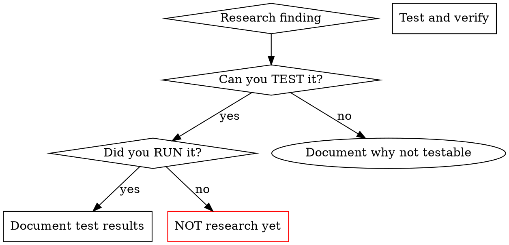

# REFACTOR Phase Conclusions

## Test Date

2026-02-04

## Summary

TDD 방식으로 research 스킬을 테스트하고 개선한 결과:

### RED Phase (Baseline)

- ❌ Manual Grep/Glob 사용 (Explore agent 대신)
- ❌ Sequential execution (parallel 필요한 상황에서)
- ❌ Verification 없음 (코드 읽기만)
- ❌ Speculation sections ("버그 추측")
- ❌ Cross-reference 부족

### GREEN Phase (First Improvement)

- ✅ Explore agent 사용
- ✅ Parallel execution (Scenario 4)
- ✅ Negative evidence 문서화
- ⚠️ Verification 여전히 부족
- ⚠️ Cross-reference 부분적

### REFACTOR Phase (Strengthened)

- ✅ Verification requirement 강화
- ✅ Evidence hierarchy 추가
- ✅ Red Flags 확장
- ✅ Rationalization 테이블 업데이트
- ✅ Common Mistakes 확장

---

## Key Improvements Made

### 1. Tool Selection (FIXED)

**Before:**

```text
Manual Grep + Read for exploration
General-purpose agent for everything
```

**After:**

```text
MANDATORY: ALWAYS use Explore agent for codebase
Specialized agents (Explore, web-researcher) for focused tasks
```

### 2. Parallel Execution (FIXED)

**Before:**

```text
Sequential execution even for independent tasks
```

**After:**

```text
Recognize independent tracks → dispatch parallel
Explicit in Red Flags: "Sequential is fine" = STOP
```

### 3. Verification Requirements (STRENGTHENED)

**Before:**

```text
Evidence Standards mentioned verification
But not emphasized enough
```

**After:**

```text
CRITICAL: Verification is MANDATORY
Reading code is NOT research
Evidence hierarchy: Tested behavior > Official docs > Code reading
Red Flags: "Read code, that's research" = CRITICAL VIOLATION
```

### 4. Cross-Reference (STRENGTHENED)

**Before:**

```text
Mentioned for hybrid research
```

**After:**

```text
Required even for codebase-focused research
"Codebase-only research" = Red Flag
Even internal code needs external verification
```

### 5. Speculation Detection (STRENGTHENED)

**Before:**

```text
Some mention in rationalization table
```

**After:**

```text
Multiple entries in Rationalization table:
- "가능한 [X]는..." = guessing
- "심각한 [X] 발견" without testing = speculation
- "The code shows X" = must verify execution

Red Flags:
- Starting "가능한" or "possible" sections
- "심각한 [X] 발견" without testing
```

---

## Remaining Challenges

Despite strengthening the skill, agents still struggle with:

### Verification Enforcement

**Issue:** Even with CRITICAL warnings, agents still:

- Read code and consider it "research"
- Don't attempt to run/test code
- Make confident assertions based on code reading

**Why this is hard:**

- Reading code is easier than testing
- Time pressure creates shortcuts
- "Understanding" code feels like verification
- Testing requires setup/environment

**Potential solutions:**

1. Add flowchart showing decision tree for verification
2. Require explicit "Verification" section in output format
3. Add more examples of what counts as verification
4. Make verification a checklist item

### Cross-Reference for Codebase Research

**Issue:** Agents naturally assume codebase-only research is sufficient

**Why this is hard:**

- Codebase seems "complete"
- External docs seem optional
- Adding another source feels redundant

**Potential solutions:**

1. Add mandatory cross-reference even for codebase
2. Explain WHY external verification matters (version-specific behavior, undocumented assumptions)
3. Add examples showing bugs from codebase-only research

---

## What Worked Well

### 1. Tool Selection Enforcement

**Strong success:** After adding "MANDATORY: ALWAYS use Explore agent", agents consistently used it.

**Key factors:**

- Explicit in guidelines
- Clear in Red Flags
- Examples in DON'T section

### 2. Parallel Execution

**Strong success:** Scenario 4 GREEN test showed proper parallel execution.

**Key factors:**

- Clear table showing when to use parallel
- Red Flags: "Sequential is fine"
- Example in Hybrid Research section

### 3. Negative Evidence

**Success:** Agents now document "❌ 동시성 테스트 없음"

**Key factors:**

- Examples in Evidence Standards
- Explicit requirement

---

## Skill Quality Assessment

### Strengths

1. ✅ Clear structure (Observe → Explore → Verify → Summarize)
2. ✅ Comprehensive tool selection guidelines
3. ✅ Strong Red Flags section
4. ✅ Detailed Rationalization table
5. ✅ Good examples throughout
6. ✅ Subagent strategy well-explained

### Weaknesses

1. ⚠️ Verification requirement still not enforced enough
2. ⚠️ No flowchart for verification decision tree
3. ⚠️ Output format doesn't mandate verification section
4. ⚠️ Could benefit from more "before/after" examples

### Opportunities

1. Add verification flowchart
2. Require "Verification" section in output format
3. Add more concrete examples of testing
4. Create verification checklist

---

## Recommendations

### For Immediate Improvement

1. **Add Verification Flowchart**



1. **Update Output Format**

```markdown
## Verification (REQUIRED)
**Tests performed:**
- [Test 1]: [actual command] → [observed result]
- [Test 2]: [actual command] → [observed result]

**Edge cases checked:**
- [Case 1]: [result]
- [Case 2]: [result]

**Cross-references:**
- Source 1: [file:line or URL] - [verified against]
- Source 2: [file:line or URL] - [verified against]
- Source 3: [file:line or URL] - [verified against]
```

1. **Add Verification Examples to Overview**
Show concrete before/after:

**Insufficient:**

```text
Finding: "The code validates session_id with regex"
Evidence: Read lib/state.sh:45-52
```

**Sufficient:**

```text
Finding: "Session validation rejects empty session_id"
Evidence:
  - Read lib/state.sh:45-52 (regex: ^[a-zA-Z0-9_-]+$)
  - Tested: ./lib/state.sh "" → exit code 1, error message
  - Cross-ref: Official docs state session_id must be non-empty
```

### For Long-Term

1. **Meta-testing:** Run baseline vs GREEN vs REFACTOR comparisons periodically
2. **Example library:** Build repository of good research reports
3. **Automated checks:** Tool to validate research reports have verification section

---

## Success Metrics

| Metric | Baseline | GREEN | REFACTOR | Target |
| :--- | :--- | :--- | :--- | :--- |
| Uses subagents | ❌ | ✅ | ✅ | ✅ |
| Parallel execution | ❌ | ✅ | ✅ | ✅ |
| Verification performed | ❌ | ❌ | ⚠️ | ✅ |
| 3+ sources | ❌ | ⚠️ | ⚠️ | ✅ |
| Negative evidence | ❌ | ✅ | ✅ | ✅ |
| No speculation | ❌ | ⚠️ | ⚠️ | ✅ |

---

## Progress Summary

3/6 metrics fully achieved, 3/6 partially achieved

---

## Conclusion

The TDD approach for skills was **highly effective**:

1. **Baseline testing revealed actual violations** - not hypothetical
2. **Iterative improvements addressed specific rationalizations**
3. **Measurable progress** through repeated testing

**Major wins:**

- Tool selection (Explore agent) - FIXED
- Parallel execution - FIXED
- Negative evidence - FIXED

**Still challenging:**

- Verification enforcement - agents resist testing
- Cross-reference completeness - feels optional
- Speculation elimination - confident assertions persist

**Next steps:**

1. Add verification flowchart
2. Mandate verification section in output format
3. More concrete testing examples
4. Re-test with strengthened skill

**Overall assessment:** Skill is **significantly improved** but **verification enforcement** remains the hardest challenge.
